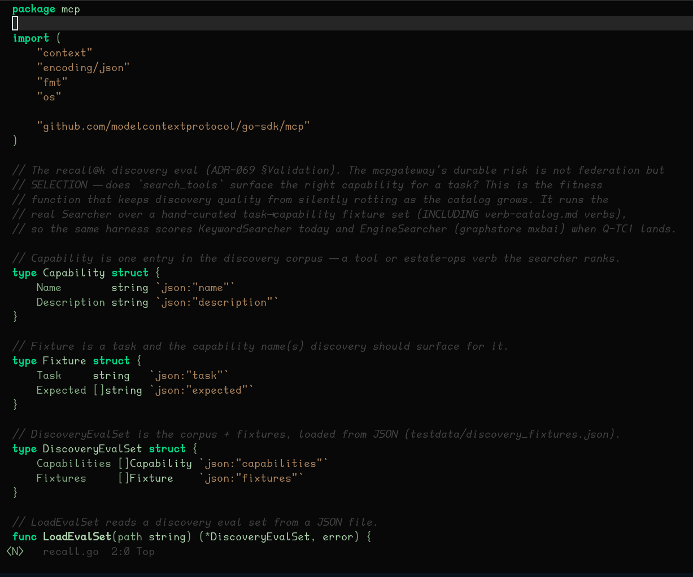

# nightpanel-theme

A dark Emacs theme modelled on a Saab instrument cluster seen at night.

Pure black canvas, instrument-scale green for body text, amber for the things
that would be a needle or a warning lamp on a real dashboard.



<sub>Screenshot captured in a 256-colour terminal, so the colours shown are the
terminal's nearest approximations rather than the exact values below. A GUI
frame renders the palette as specified.</sub>

## Design

The palette is deliberately narrow, and each colour has one job:

| Role | Colour | Used for |
|---|---|---|
| Canvas | `#0A0A0A` | default background |
| Body text | `#7DB890` | default foreground, variables |
| Accent | `#26DE81` | keywords, matches, the current line number |
| Needle | `#E8930A` | search hits, constants, warnings, TODO |
| Needle (dim) | `#B08030` | strings, cursor, changed hunks |
| Recede | `#2E5040` | comments, inactive chrome, shadow |
| Fault | `#EF4444` | errors only |

Comments and inactive chrome sit at the dimmest green on purpose, so the code
itself is the brightest thing on screen. Red is reserved for genuine faults —
if something is red, it is broken.

## Install

### MELPA

```
M-x package-install RET nightpanel-theme RET
```

Then:

```elisp
(load-theme 'nightpanel t)
```

### Manual

Drop `nightpanel-theme.el` somewhere on your `custom-theme-load-path`:

```elisp
(add-to-list 'custom-theme-load-path "~/.emacs.d/themes/")
(load-theme 'nightpanel t)
```

## Requirements

Emacs 27.1 or newer. The floor is set by the `tab-bar` and `tab-line` faces the
theme styles; on older Emacs those are simply ignored and the rest still works.

## Terminal use

Nightpanel targets true-colour displays. Face specs are 24-bit hex with no
`min-colors` fallback, so in a low-colour terminal Emacs will approximate them
and the result will not match a GUI frame. If you live in a 256-colour tty,
this theme is not tuned for you yet.

## License

GPL-3.0-or-later. See [LICENSE](LICENSE).
